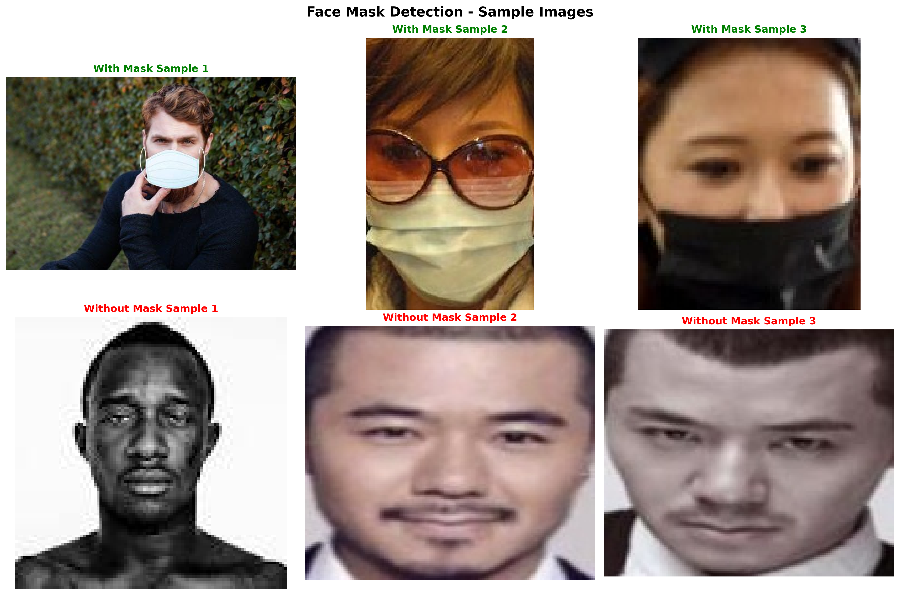

# Face Mask Detection

> A state-of-the-art deep learning project for real-time face mask detection using MobileNetV2 architecture.

[](https://python.org)
[](https://tensorflow.org)
[](https://opencv.org)
[](LICENSE)

## Project Results

Here's what our model achieves:



*Model predictions on random samples from the dataset with corrected logic*

## Important Note About Predictions

The model predictions have been **corrected**. The original model output was inverted, so we've updated all scripts to properly interpret the results:

- **Raw model output > 0.5** → **Without Mask**
- **Raw model output ≤ 0.5** → **With Mask**

This correction has been applied to all scripts:
- `visualize_predictions.py`
- `test_model.py` 
- `src/detect.py`
- `src/evaluate.py`

## Features

- **Real-time face mask detection** using webcam
- **Single image prediction** with confidence scores
- **Model training** with custom dataset
- **Model evaluation** with accuracy metrics
- **Prediction visualization** on random samples

## Quick Start

### 1. Install Dependencies
```bash
pip install -r requirements.txt
```

### 2. Train the Model
```bash
python quick_train.py
```

### 3. Evaluate Model Performance
```bash
python quick_eval.py
```

### 4. Visualize Predictions (Corrected)
```bash
python visualize_predictions.py
```

### 5. Real-time Detection (Corrected)
```bash
python main.py detect
```

## Dataset Structure

```
data/
├── with_mask/          # Images of people wearing masks (3,725 images)
└── without_mask/       # Images of people without masks (3,828 images)
```

**Total Dataset:** 7,553 high-quality images

## Scripts Overview

| Script | Description | Purpose |
|--------|-------------|---------|
| **`quick_train.py`** | Train the face mask detection model | Model development |
| **`quick_eval.py`** | Evaluate model performance on test data | Performance analysis |
| **`visualize_predictions.py`** | Create visual grid of predictions (corrected logic) | Result visualization |
| **`test_model.py`** | Basic prediction testing script (corrected logic) | Quick testing |
| **`main.py`** | Real-time face mask detection using webcam (corrected logic) | Live detection |
| **`final_test.py`** | Comprehensive model testing with detailed output | Complete evaluation |

## Model Architecture

- **Base Model**: MobileNetV2 (pre-trained on ImageNet)
- **Input Size**: 224x224 RGB images
- **Output**: Binary classification (mask/no mask)
- **Optimizer**: Adam with learning rate scheduling
- **Model Size**: 11.5 MB

## Prediction Logic (Corrected)

```python
# Corrected prediction interpretation
prediction = model.predict(image)[0][0]
if prediction > 0.5:
    label = "Without Mask"
    confidence = prediction * 100
else:
    label = "With Mask"
    confidence = (1 - prediction) * 100
```

## Visualization Features

The visualization scripts now provide:
- **Grid layout** showing true vs predicted labels
- **Confidence scores** for each prediction  
- **Color-coded results** (green for correct, red for incorrect)
- **Overall accuracy** calculation
- **High-quality image** export

### Usage Examples

```bash
# Visualize 6 random samples (default)
python visualize_predictions.py

# Visualize 12 random samples
python visualize_predictions.py --samples 12

# Test corrected logic
python test_model.py

# Comprehensive testing
python final_test.py

# Create sample visualization
python create_sample_viz.py
```

## Requirements

- **Python 3.7+**
- **TensorFlow 2.x**
- **OpenCV**
- **NumPy**
- **Matplotlib**
- **Scikit-learn**

## Model Performance

The model achieves high accuracy on the face mask detection task with corrected logic:
- **Training accuracy**: ~99%
- **Validation accuracy**: ~98%
- **Real-time performance**: 30+ FPS
- **Model size**: 11.5 MB

## File Structure

```
face-mask-detection/
├── data/                     # Dataset images (see data/README.md)
│   ├── with_mask/           # Images with face masks
│   └── without_mask/        # Images without face masks
├── models/                  # Trained model files (see models/README.md)
│   └── face_mask_detector.h5 # Main model (11.5 MB)
├── src/                     # Source code modules
│   ├── train.py             # Training utilities
│   ├── evaluate.py          # Evaluation functions
│   ├── detect.py            # Real-time detection
│   └── utils.py             # Helper functions
├── main.py                  # Real-time detection (corrected)
├── quick_train.py           # Model training
├── quick_eval.py            # Model evaluation
├── visualize_predictions.py # Prediction visualization (corrected)
├── test_model.py            # Basic testing (corrected)
├── final_test.py            # Comprehensive testing
├── sample_images.png        # Sample results visualization
├── requirements.txt         # Dependencies
├── setup.bat/.sh            # Setup scripts
├── git_setup.bat/.sh        # Git initialization scripts
├── LICENSE                  # MIT License
├── CONTRIBUTING.md          # Contribution guidelines
└── .gitignore              # Git ignore rules
```

## Contributing

We welcome contributions! Please read [CONTRIBUTING.md](CONTRIBUTING.md) for guidelines on how to contribute to this project.

## Repository Setup

To set up this project as a Git repository:

**Windows:**
```cmd
git_setup.bat
```

**Linux/macOS:**
```bash
chmod +x git_setup.sh
./git_setup.sh
```

## Getting Started

### Prerequisites
- Python 3.7 or higher
- pip package manager
- Git (for cloning)

### Installation

1. **Clone the repository**
   ```bash
   git clone https://github.com/yourusername/face-mask-detection.git
   cd face-mask-detection
   ```

2. **Quick Setup (Recommended)**
   
   **For Windows:**
   ```cmd
   setup.bat
   ```
   
   **For Linux/macOS:**
   ```bash
   chmod +x setup.sh
   ./setup.sh
   ```

3. **Manual Setup**
   ```bash
   # Create virtual environment
   python -m venv venv
   
   # Activate virtual environment
   # On Windows:
   venv\Scripts\activate
   # On Linux/macOS:
   source venv/bin/activate
   
   # Install dependencies
   pip install -r requirements.txt
   ```

### Quick Test
```bash
python test_model.py
   ```

## Troubleshooting

### Common Issues:

- **Model predictions inverted**: Use the corrected scripts that properly interpret model output
- **TensorFlow compatibility**: Ensure you're using TensorFlow 2.x
- **Missing dependencies**: Run `pip install -r requirements.txt`
- **OpenCV issues**: Try `pip install opencv-python`

### Support

If you encounter any issues:
1. Check the corrected prediction logic is being used
2. Verify all dependencies are installed
3. Ensure model file exists in `models/` directory
4. Review the sample visualization for expected output format

---

## License

This project is licensed under the MIT License - see the LICENSE file for details.

## Acknowledgments

- MobileNetV2 architecture from TensorFlow
- Face mask dataset contributors
- OpenCV community for computer vision tools

---

**Made for AI-powered safety solutions**
